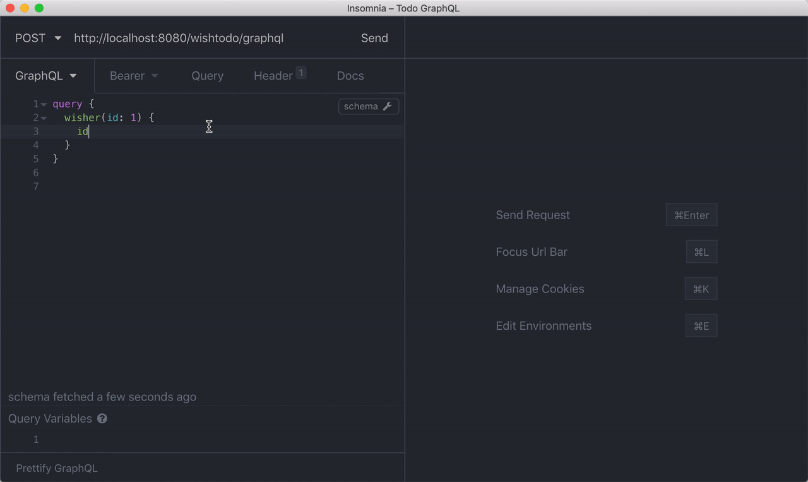

# Wishtodo Spring Service

[](https://github.com/codetrial/wish-todo-spring)
[](https://github.com/codetrial/wish-todo-spring)

A classic todo service based on Jhipster and Spring.

## Docs

[:zap: Live Demo](https://codetrial-gateway.felixpy.com/wishtodo/api/todos) | [:book: Docs](https://codetrial.github.io/wishtodo)

## Screen Capture



## QuickStart

### Development

To start your application in the dev profile, simply run:

```bash
npm install

./mvnw
npm start
```

### Building for production

To optimize the wishtodo application for production, run:

```bash
./mvnw -Pprod clean package
```

To ensure everything worked, run:

```bash
java -jar target/*.war
```

### Testing

To launch your application's tests, run:

```bash
./mvnw clean test
```

## Core Features

- :radio: Restful
- :mag_right: GraphQL
- :ghost: Microservice

## Contributing

Looking forward to your pull requests.

## Built With

- [GraphQL Java](https://github.com/graphql-java/graphql-java)
- [Spring Boot](https://github.com/spring-projects/spring-boot)
- [JHipster](https://github.com/jhipster)

## License

[MIT](http://opensource.org/licenses/MIT)

Copyright (c) 2018 - present, Felix Yang
